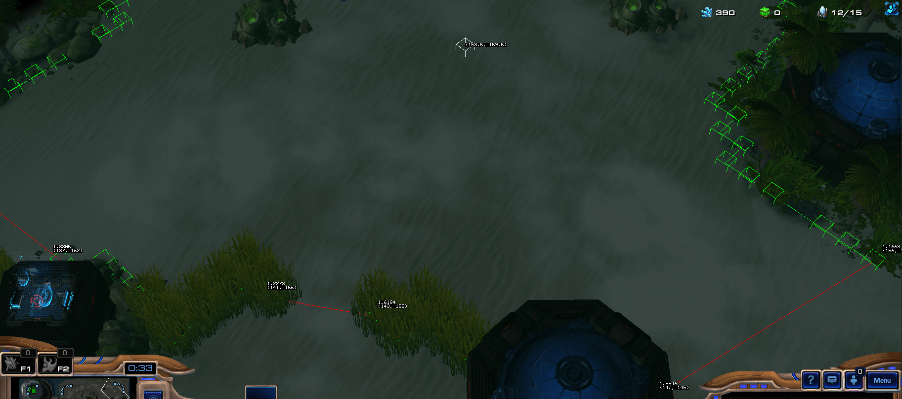

# Starcraft 2 Map Segmentation
This is a plugin for the Python SC2 API, [BurnySc2/python-sc2](https://github.com/BurnySc2/python-sc2).

**SC2 Map Segmentation** provides fully automated segmentation for Starcraft 2 maps. The goal is to offer functionality similar to [SC2MapAnalysis](https://github.com/spudde123/SC2MapAnalysis), but with a focus on dividing the map into smaller regions. This is a feature not currently available in SC2MapAnalysis. Additionally, SC2 Map Segmentation identifies passages between these regions, such as choke points and ramps. It also includes a basic implementation of the Dijkstra pathfinding algorithm.

Please note that this project is still under development and may not have as many features as SC2MapAnalysis at this time.

### Example of segmentation

Top view of the map: https://liquipedia.net/commons/images/7/77/Site_Delta.jpg

Other examples from _Sc2 AI Arena 2023 Season 3_ map pool are in [data/map_pool](data/map_pool) folder.

### How it works
The algorithm operates by identifying key locations (referred to as 'seed points') on the map, such as expansions, ramps, etc. It then scans the surrounding area for the nearest unpathable/unbuildable tiles.

Tiles that create a large angle between the previous tile and the seed point are filtered out. Points that are significantly distant from the previous point are identified as potential choke points. These choke points are then marked on the map.

Next, the algorithm performs a flood fill operation from the seed point, avoiding crossing through any choke points.

Example of depth scan, white point is seed point, greed points are scanned points, red lines are choke points:

Finally, the map undergoes a cleanup process. This includes steps such as removing small regions and merging regions that are in close proximity to each other.

## Installation
1. Clone this repository
2. Install requirements
3. Copy `mapsegmentation` folder to your project

## Usage
An example of usage can be found in [examples/reaper_pathfinding.py](examples/reaper_pathfinding.py). This is a simple bot that finds a path to the enemy base for a Reaper unit using the Dijkstra algorithm.

The segmented map can be serialized using pickle and saved to a file for future use.

There are three main data classes that represent the segmented map, which can be found in the [mapsegmentation/dataclasses](mapsegmentation/dataclasses) folder:
- `SegmentedMap`: Contains all segments and passages between them.
- `Region`: Represents a single segment of the map.
- `Passage`: Represents a passage between regions.

## Limitations, Future Work, and Contributions

- The current segmentation algorithm may produce asymmetrical regions.
- The algorithm does not yet identify cliff passages where units, like Reapers, need to jump multiple times to traverse.
- The feature set is not as extensive as that of MapAnalysis.

Contributions are welcome and greatly appreciated. If you're interested in contributing, please feel free to submit a pull request. Any help is valuable as my time to work on this project is limited.